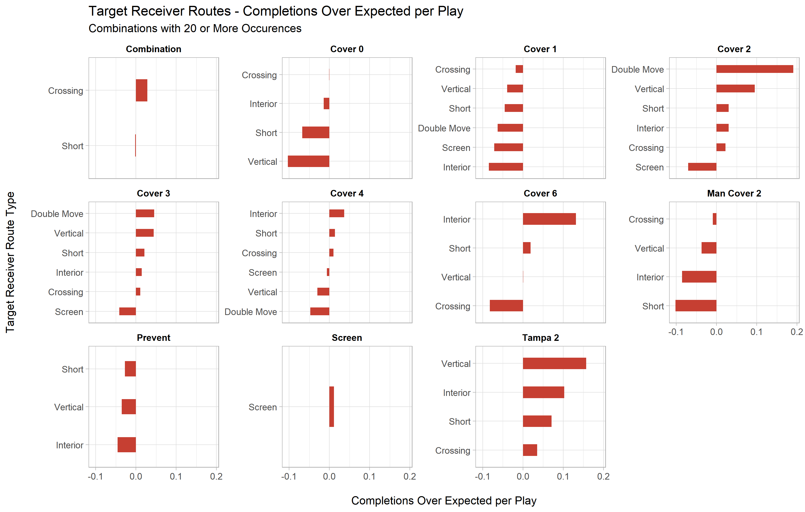
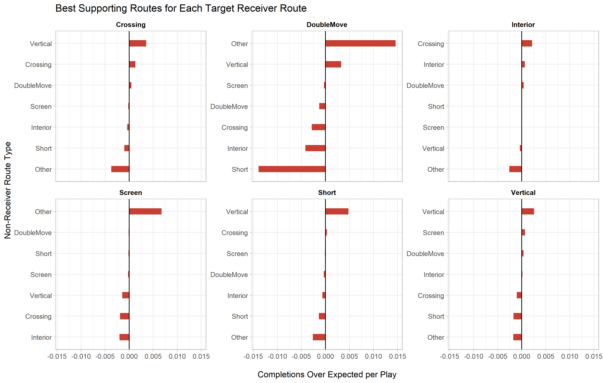
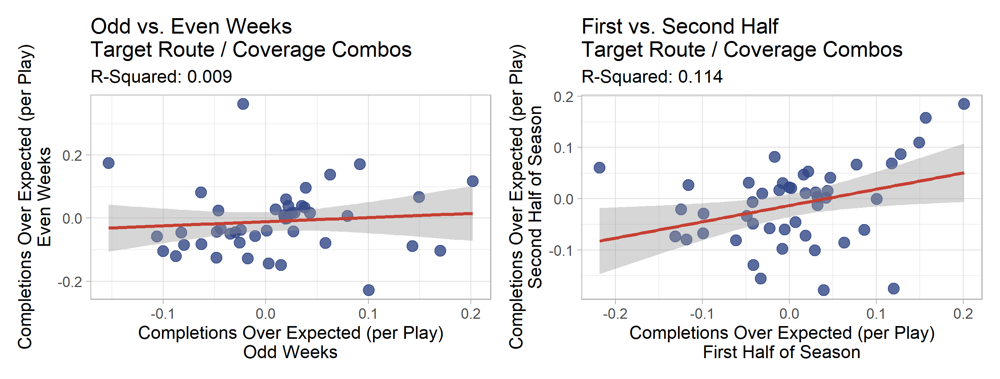

# SISAnalyticsChallenge2021
## Analysis of Routes and Coverages in the NFL
### Dani Treisman

# Introduction

This report is an analysis of route combinations and coverage schemes for the [2021 Sports Info Solutions Analytics Competition](https://www.sportsinfosolutions.com/sports-info-solutions-to-host-2nd-annual-sports-analytics-challenge-to-raise-money-for-the-boys-and-girls-clubs-of-america/). The prompt for the football track of this years competition is: *Which route combinations were most popular in the NFL in 2020? Of these route combinations, which perform best against each coverage type?* This seemed to me to be slightly open ended and offered an opportunity to explore various methods and areas of analysis in regard to routes on passing plays in the NFL. The data for the competition is tracked by SIS and includes data from the 2020 season.

Many analyses in football boil down to an assessment of Expected Points Added for whatever facet of the game the analyst is attempting to evaluate. In the case of Wide Receiver routes, each route has a different objective. While the goal of any play is to get as many yards down the field, throwing deep every play may not be an effective strategy, even though the deep yardage plays have a higher EPA. Offensive passing play calls in football usually involve a large mix of route combinations in order to veil their intentions. It would be easy to defend an offense if the defense knew the opposing quarterback would throw deep every time. Therefore, I evaluate route combinations and coverage schemes from the perspective of play success. I believe that looking at play success is a better starting point for understanding the effectiveness of the different combinations as it mirrors the decisions that likely go into offensive play-calling.

# Modeling

For this analysis, I used a Generalized Linear Mixed Model to predict the probability of a completion on each play. While it is generally important to have the most accurate model possible, the goal of this analysis is inferential in nature, so presenting model evaluation is not necessarily as important, although I will include it.

In trying to evaluate route and coverage combinations, I attempt to analyze the probability of a successful play versus the expectation. Therefore, only situational variables that occur prior to the pass are included. I removed all non-pass plays and plays with a fumble by the passer. Also, the original data included over 45 individual route types. Using the route definitions given in the competition documents, I binned the route types into 7 categories: Crossing, Vertical, Short, Double Move, Interior, Screen and Other (includes blocking, pick, and run fake). I included routes by all wide receivers, running backs, and tight ends.

As mentioned earlier, I used a Generalized Linear Mixed Model to predict the probability of a completion.

The fixed effects are

-   Down
-   ToGo - Yards to go for first down
-   SideOfField - Own vs. Opponent
-   StartYard - Yard line the play started on (paired with SideOfField to get field position)
-   Shotgun - 1 if the QB lined up in shotgun pre-snap, 0 otherwise
-   DropType - Categorical variable describing the type of drop the QB took on a pass play. Most are in terms of the number of steps back he took, but there are other items for designed rollouts or screens.
-   FastMotion - 1 if the target receiver was in motion before the play, 0 if not.

To account for team skill, I included random effects for both the Offensive and Defensive teams. Lastly, I included random effects for the route type of the target receiver on the play and the coverage scheme.

The model had a validation log-loss of .584, compared to a log-loss of .633 for the naive prediction (mean success of a play: 0.67). I did attempt more complex modeling techniques such as a Random Forest, but the GLMM performed better.

The analysis of the stability of the models can be found in the appendix.

# Target Receiver Route/Coverage Analysis

The first step of analyzing route and coverage combinations is to look at the route of the target receiver. The plot below show each route's *Completions Over Expected (COE)* within each coverage type. Play success is defined as a completion. The calculation here is **Completed Pass (1 or 0) - Predicted Probability of Completed Pass.** Since the model includes a random intercept for both coverage type and the target receiver route, the values below represent the value over expectation *within* each pairing, as apposed to the value over expectation of all plays.

No routes have a positive Completions Over Expected value for Cover 0, Cover 1, and Man Cover 2 defenses. Double Move and Vertical routes have the highest COE against Cover 2. Most of the other Defenses have relatively small effects.

# Analysis of Supporting Routes

The next step of this analysis is to look at supporting routes, meaning, routes by non-target receivers.

There are two problems with just looking at target routes. The first is that we cannot necessarily assume that the target receiver on a play is known before the play begins. That issue, however, can be dealt with continuous time, within-play evaluation using tracking data (which was done by many of projects from the NFL Big Data Bowl) which is not available in the competition dataset. Knowing those continuous probabilities would make this analysis more specific.

The second issue, however, is what I will account for in this section. On a given pass play, there are several receivers (including running backs) running various routes. While they are all trying to get open for a pass, their jobs on the field are also part of the strategy behind the play design and one player's route may give a different player a better chance at getting open by fooling the safety or the linebacker in coverage, etc.

In order to attribute value to the supporting routes on a play, I distributed a portion of the Completion Over Expected ( **Completed Pass (1 or 0) - Predicted Probability of Completed Pass)** value equally among each individual route on the play.

The plots below show a break down of the Completions Over Expected per Play for each target receiver aggregated for each route type. I did not include "Other" here as a facet because the assumption is that "Other" routes such as blocking or pick routes are usually not the intended receiver. However, these types of routes are often helpful in confusing the defense or providing support for a receiver.

The values here are quite small and not significant. I do think the sample size is limiting here but I would say from this analysis that supporting routes do not have a strong effect on the outcome of a pass play.

# Conclusion

In this report I used a Generalized Linear Mixed Model to predict the probability of a completion on a passing play. It is difficult for me to present notable findings due to my limited knowledge of play design. However, some things I found interesting were that no target receiver route types had a positive Completions Over Expected against Cover 0, Cover 1, and Man Cover 2 defenses. This might be due to the fact that the route types have been binned for the sake of simplicity and there might be routes within those groups that do have positive values.

This data presents many challenges for this type of analysis. I binned each Route into the 7 route categories. With 12 coverage types, that makes 84 combinations of *binned* route/coverage combinations. A sample size of 16000 is not quite large enough to find a strong effect in these binned categories. With more data, I believe it would be possible to use more specific route definitions in order to be more specific about the route/coverage comparisons. It seems to me that some of the small values might be due to various routes within the route type categories canceling each other out.

Another challenge was that the data is only on the play level. That prevents us from more granular types of analysis as I mentioned above. I think this approach could be extended to data on the frame level in order to evaluate the effect of various route combinations in a continuous manner.

Lastly, my method for attributing values to supporting routes is quite basic. It may not accurately account for how much effect the supporting route has on the completion probability for the target receiver. This analysis could be extended to look at how the side that the "support receiver" is standing on affects completion probability. With more time, I would have like to explore a network analysis of those more specific factors such as the order of where each receiver stands on the line of scrimmage.

Thank you for your time in reading this report. You can find me at the various links below:

-   [Project Code](https://github.com/dtreisman/SISAnalyticsChallenge2021)
-   Twitter: [\@DaniTreisman](https://twitter.com/DaniTreisman)
-   [Portfolio](https://dtreisman.github.io/Portfolio/)
-   [LinkedIn](https://www.linkedin.com/in/dani-treisman/)

# Appendix

In order to determine the stability of Completions Over Expected for the route/coverage combinations, I looked at the R-Squared values within a season. Ideally, I would test this using two/multiple seasons but I only have one season of data. I therefore looked at the correlation between odd and even weeks and between the first and second half of the season. As shown in the graphs below, odd vs. even weeks have very little signal, but first vs. second half have moderate stability with an R-Squared of .114. I only included combinations that appeared more than 20 times.

As shown below, the stability of the Completions Over Expected for supporting route/target route combinations is also moderately stable both within season and from first to second half.

There does seem to be many outlier values for both analyses which I believe is a symptom of small sample size since many of the combinations do not occur often.
